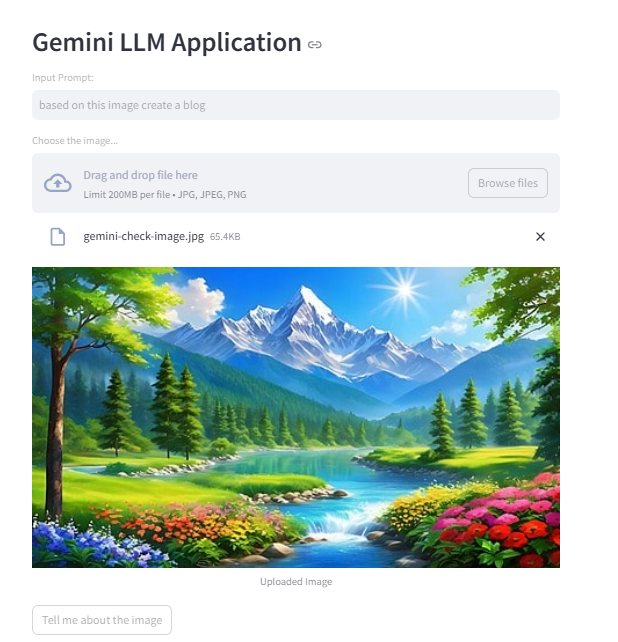

# Gemini LLM Image and Text Q&A Application

This project is a web application built using Streamlit, designed to interact with Google's Gemini LLM ("gemini-1.5-flash" model) for generating responses based on user-uploaded images and optional text prompts.

## Table of Contents

- [Features](#features)
- [Installation](#installation)
- [Usage](#usage)
- [Environment Variables](#environment-variables)
- [Project Structure](#project-structure)
- [.gitignore](#.gitignore)
- [Contributing](#contributing)
- [License](#license)

## Features

- **Image Analysis:**
  - Allows users to upload images in JPG, JPEG, or PNG formats.
  - Generates responses based on the content of the uploaded image.
  
- **Text Prompt Integration:**
  - Users can optionally provide a text prompt to receive a more contextual response related to the image.

- **User-Friendly Interface:**
  - Built with Streamlit for easy interaction and a clean, responsive UI.

## Installation

To run this project locally, follow these steps:

1. **Clone the repository:**
   ```bash
   git clone https://github.com/yourusername/gemini-llm-image-app.git
   cd gemini-llm-image-app
  ```

2. **Create a virtual environment:**

``` bash 
python3 -m venv venv
source venv/bin/activate  # On Windows, use `venv\Scripts\activate`

```

3. **Install the required dependencies:**

``` bash 
pip install -r requirements.txt
```

4. **Set up environment variables:**

Create a `.env` file in the root directory and add the necessary environment variables. For example:

``` bash 
GOOGLE_API_KEY=your_google_api_key_here
```


5. Run the application:
``` bash 
streamlit run vision.py
```

## Usage

Once the application is running, open your web browser and go to `http://localhost:8501`. The main features include:

- **Upload an Image:**
  - Choose an image file (JPG, JPEG, PNG) and upload it.

- **Input your text prompt (optional):**
  - Type your question or prompt related to the image into the input box.

- **Submit and view the response:**
  - Click the "Tell me about the image" button to send the image (and optional prompt) to the Gemini LLM.
  - View the response generated by the model.
 
  - ## Screenshot

Here’s a screenshot of the application in action:



## Environment Variables

The project uses environment variables to manage sensitive information like API keys. These variables are stored in a `.env` file, which is loaded by the `python-dotenv` library. Below is a sample `.env` file configuration:

``` bash 
GOOGLE_API_KEY=your_google_api_key_here
```

## Project Structure

├── .env                      # Environment variables file
├── .gitignore                # Files and directories to be ignored by Git
├── LICENSE                   # License file
├── README.md                 # Project documentation
├── vision.py                 # Main application file
├── requirements.txt          # List of dependencies

## Contributing 

Contributions are welcome! Please fork this repository and submit a pull request with your proposed changes. Ensure that your code  is well-documented.

## License

This project is licensed under the [Apache License 2.0](./LICENSE). You may use, modify, and distribute this software in accordance with the terms of the license.
